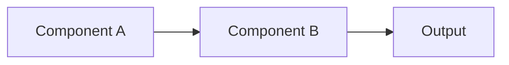

# [Technology/Tool Name]  
`🏷️ Category:` [Programming Language/Framework/Database/etc.]  
`🔗 Official Docs:` [URL]  
`🔄 Last Reviewed:` [YYYY-MM-DD]  

## 🌟 Overview
- **What it is:** [1-2 sentence definition]
- **Why it matters:** [Key benefits/differentiators]
- **Main Alternatives:** [Competing technologies]
- **Ideal Use Cases:** 
  - Case 1
  - Case 2

## 🧠 Core Concepts
### Key Terminology
| Term          | Definition                          |
|---------------|-------------------------------------|
| Concept A     | Explanation                         |
| Concept B     | Explanation with example            |

### How It Works


## 🛠️ Setup Guide
### Installation
```bash
# Platform-specific install commands
brew install [tool]
# OR
pip install [package]
```

### Configuration
```yaml
# Sample config snippet
key: value
critical_setting: true
```

## 📝 Basic Usage
### Common Commands

```bash
[command] --flag # Explanation
```

### Minimal Example

```python
# Code snippet showing simplest working example
def hello_world():
    return "Hello World"
```

## 🏗️ Advanced Patterns
### Pattern 1: [Description]

```python
# Implementation code
```

### Pattern 2: [Description]


## ⚠️ Pitfalls & Solutions
| Common Mistake | Why It Happens | How to Fix |
|---------------|----------------|------------|
| Example       | Root cause     | Solution   |

## 🔍 Real-World Application
**Project Context:** [Where you used it]  
**Implementation Insight:**
```sql
-- Sample query or config
SELECT * FROM table
```

## 📚 Learning Resources
### Essential
- [ ] [Official Documentation](url)
- [ ] [Key Tutorial](url)

### Supplemental
- [ ] [Book] Title by Author
- [ ] [Video] Conference Talk
- [ ] [Article] "5 Things I Wish I Knew About X"
