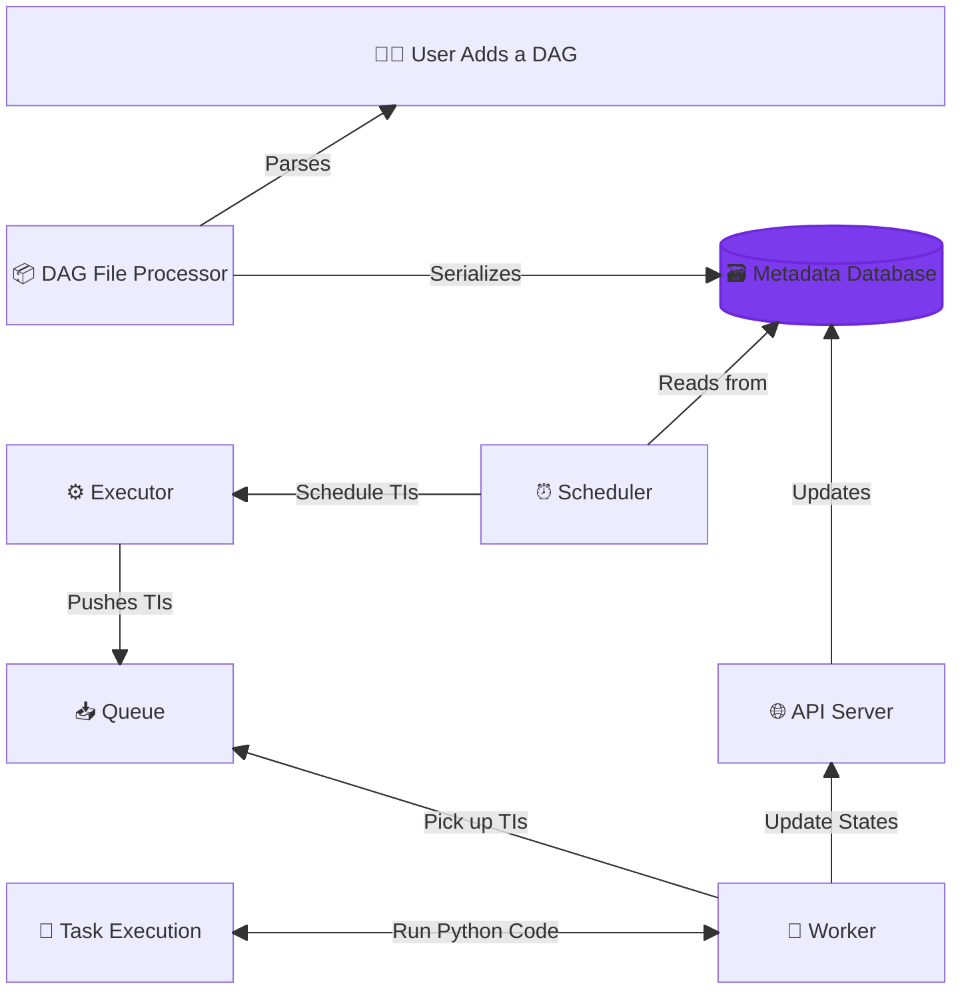

<picture width="500">
  
</picture>


[](https://airflow.apache.org)
[](https://s.apache.org/airflow-slack)

---

## 🌟 Overview

- **What it is:** Apache Airflow is an open-source workflow orchestrator for building, scheduling, and monitoring data pipelines using Python.
- **Why it matters:** It enables scalable, code-first pipeline automation with full visibility, retries, alerts, and dynamic DAG generation.
- **Ideal Use Cases:** ETL/ELT jobs, data warehousing, ML pipelines, batch processing, dependency-driven job orchestration.
- **Main Alternatives:**
  - **Prefect** – simpler API, better for hybrid execution
  - **Dagster** – strongly typed, dev-centric
  - **Kubeflow** – for ML workflows on Kubernetes
  - **AWS Step Functions / Google Cloud Composer** – managed orchestration in the cloud

---

## 📑 Table of Contents

1. [How It Works](#how-it-works)
1. [Installation & Setup](#installation--setup)
1. [Basic Configuration](#basic-configuration)
1. [DAG Definition](#dag-definition)
1. [Task Types & Operators](#task-types--operators)
1. [Task Dependencies & Control Flow](#task-dependencies--control-flow)
1. [XCom & Data Passing](#xcom--data-passing)
1. [Connections & Variables](#connections--variables)
1. [Sensors](#sensors)
1. [Error Handling & Retries](#error-handling--retries)
1. [Scheduling & Triggers](#scheduling--triggers)
1. [Testing & Debugging](#testing--debugging)
1. [Best Practices](#best-practices)
1. [Common Patterns](#common-patterns)
1. [Configuration Examples](#configuration-examples)
1. [Advanced Features](#advanced-features)
1. [CLI Commands](#cli-commands)

---

## How It Works

**DAG Execution Lifecycle:**



---

## Installation & Setup

```bash
# Use official Airflow Docker image
curl -LfO 'https://airflow.apache.org/docs/apache-airflow/3.0.0/docker-compose.yaml'
docker compose up airflow-init
```

Or, use `pip`:

```bash
pip install apache-airflow==3.0.* --constraint "https://raw.githubusercontent.com/apache/airflow/constraints-3.0.0/constraints-3.10.txt"
```

---

## Basic Configuration

### Essential Imports

```python
from airflow import DAG
from airflow.decorators import dag, task
from airflow.operators.python import PythonOperator
from airflow.operators.bash import BashOperator
from airflow.operators.dummy import DummyOperator
from airflow.sensors.filesystem import FileSensor
from airflow.hooks.postgres_hook import PostgresHook
from airflow.models import Variable
from airflow.exceptions import AirflowException
from datetime import datetime, timedelta
import pendulum
```

### DAG Default Arguments

```python
default_args = {
    'owner': 'data-team',
    'depends_on_past': False,
    'start_date': datetime(2024, 1, 1),
    'email_on_failure': True,
    'email_on_retry': False,
    'retries': 3,
    'retry_delay': timedelta(minutes=5),
    'execution_timeout': timedelta(hours=2),
    'sla': timedelta(hours=4),
    'max_active_runs': 1,
    'catchup': False
}
```

---

## DAG Definition

### Basic DAG Definition

```python
@dag(
    dag_id='data_pipeline_example',
    default_args=default_args,
    description='Modern data pipeline using TaskFlow API',
    schedule='@daily',
    start_date=pendulum.datetime(2025, 1, 1, tz="UTC"),
    catchup=False,
    max_active_runs=1,
    tags=['data', 'etl']
)
def data_pipeline():
  ...

# Instantiate the DAG
data_pipeline_dag = data_pipeline()
```

<details>
  <summary><b>Full Code Example</b></summary>

  ```python
@dag(
    dag_id='data_pipeline_example',
    default_args=default_args,
    description='Modern data pipeline using TaskFlow API',
    schedule='@daily',
    start_date=pendulum.datetime(2025, 1, 1, tz="UTC"),
    catchup=False,
    max_active_runs=1,
    tags=['data', 'etl']
)
def data_pipeline():

    @task
    def extract() -> dict[str, int | str]:
        return {"records": 1000, "status": "success"}

    @task
    def transform(raw_data: dict[str, Any]) -> dict[str, Any]:
        return {
            "processed_records": raw_data["records"],
            "transformation_time": datetime.now().isoformat()
        }

    @task
    def load(processed_data: dict[str, Any]) -> str:
        print(f"Loading {processed_data['processed_records']} records")
        return "Data loaded successfully"

    # Define task dependencies
    data = extract()
    transformed_data = transform(data)
    load(transformed_data)

# Instantiate the DAG
data_pipeline_dag = data_pipeline()
```

</details>

<details>
  <summary><b>DAG Arguments</b></summary>

| Argument                        | Description                                                               | Example                                             | Best Practice                                               |
| ------------------------------- | ------------------------------------------------------------------------- | --------------------------------------------------- | ----------------------------------------------------------- |
| `dag_id`                        | Unique identifier for the DAG (must be unique across all DAGs)            | "etl\_sales\_pipeline"                              | Use lowercase, underscores, and meaningful naming           |
| `schedule`                      | Defines how often the DAG runs. | "@daily", "@hourly", `None`, or `timedelta(days=1)` | Use cron expressions or presets. Use `None` for manual DAGs |
| `start_date`                    | Date and time the DAG starts running from                                 | `datetime(2024, 1, 1)`, `days_ago(2)`               | Always set explicitly. Avoid `datetime.now()`               |
| `end_date`                      | Last valid execution date for the DAG                                     | `datetime(2025, 1, 1)`                              | Only use if the DAG has a finite lifecycle                  |
| `catchup`                       | Whether to run DAG for past missed intervals                              | `False`                                             | Set to `False` unless explicitly doing backfills            |
| `max_active_runs`               | Max number of DAG runs that can be active simultaneously                  | `1`                                                 | Use `1` for non-idempotent DAGs                             |
| `default_args`                  | Default task arguments as a dictionary                                    | `{ "owner": "team", "retries": 2 }`                 | Centralize retry/email configs. Avoid repetition            |
| `tags`                          | List of strings to categorize DAGs in UI                                  | `["etl", "sales"]`                                  | Use for filtering/grouping in UI                            |
| `params`                        | Dictionary accessible via Jinja templating                                | `{ "env": "prod" }`                                 | Use for environment-based behavior                          |
| `doc_md`                        | DAG-level documentation in Markdown                                       | `"""### Title\nDetails"""`                          | Document DAG purpose and owner                              |
| `max_active_tasks`              | Max number of tasks that can run in parallel                              | `10`                                                | Tune based on resource usage                                |

</details>

### 🔌 Triggering Other DAGs

```python
from airflow.operators.trigger_dagrun import TriggerDagRunOperator

trigger = TriggerDagRunOperator(
    task_id="trigger_downstream",
    trigger_dag_id="downstream_dag_id",
)
```

---

## Task Types & Operators

### Python Task

```python
@task # or @task.python
def process_data(data_source: str, **context) -> dict[str, Any]:
    execution_date = context['execution_date']
    return {
        'source': data_source,
        'processed_at': execution_date.isoformat(),
    }
```

<details>
  <summary> <h3>Bash Task </h3> </summary>

```python
@task.bash
def run_bash_command():
    return "echo 'Hello from Bash' && date"

# Or using BashOperator
bash_task = BashOperator(
    task_id='bash_example',
    bash_command='echo "Current date: $(date)"',
    env={'ENV_VAR': 'production'}
)
```

</details>

<details>
  <summary> <h3>SQL Task </h3> </summary>

```python
@task
def execute_sql():
    from airflow.hooks.postgres_hook import PostgresHook

    postgres_hook = PostgresHook(postgres_conn_id='postgres_default')

    sql_query = """
    SELECT COUNT(*) as record_count
    FROM users
    WHERE created_date >= '{{ ds }}'
    """

    result = postgres_hook.get_first(sql_query)
    return result[0] if result else 0

# Using SQLExecuteQueryOperator
from airflow.operators.sql import SQLExecuteQueryOperator

sql_task = SQLExecuteQueryOperator(
    task_id='sql_example',
    conn_id='postgres_default',
    sql="""
    INSERT INTO processed_data
    SELECT * FROM raw_data
    WHERE process_date = '{{ ds }}'
    """
)
```

</details>

<details>
  <summary> <h3>Docker Task </h3> </summary>

```python
@task.docker
def docker_process():
    return {
        'image': 'python:3.9',
        'command': 'python -c "print(\'Hello from Docker\')"',
        'auto_remove': True
    }

# Using DockerOperator
from airflow.operators.docker_operator import DockerOperator

docker_task = DockerOperator(
    task_id='docker_example',
    image='python:3.9',
    command='python -c "import pandas as pd; print(pd.__version__)"',
    auto_remove=True,
    docker_url='unix://var/run/docker.sock'
)
```

</details>

---

## Task Dependencies & Control Flow

### Chaining with Return Values

```python
data = extract()
transformed_data = transform(data)
load = load(transformed_data)
```

### 🧬 Dynamic Task Mapping

✅ Best Practice: Keep mappable tasks atomic and stateless

```python
@task
def generate_values() -> list[int]:
    return [1, 2, 3]

@task
def process(x: int) -> None:
    print(f"Processing: {x}")

process.expand(x=generate_values())

```

### Branching

```python
import random

@task.branch
def branch_task() -> str:
    return 'process_data' if random.choice([True, False]) else 'skip_processing'

@task
def process_data() -> str:
    return "Data processed"

@task
def skip_processing() -> str:
    return "Processing skipped"

# In DAG
branch = branch_task()
process = process_data()
skip = skip_processing()

branch >> [process, skip]
```

### Dynamic Task Generation

```python
@task
def get_data_sources() -> list[str]:
    return ['source_1', 'source_2', 'source_3']

@task
def process_source(source_name: str) -> str:
    return f"Processed {source_name}"

@task
def combine_results(results: list[str]) -> str:
    return f"Combined {len(results)} results"

# Dynamic task mapping
@dag(dag_id='dynamic_tasks', schedule='@daily', start_date=datetime(2024, 1, 1))
def dynamic_pipeline():
    sources = get_data_sources()
    processed = process_source.expand(source_name=sources)
    combine_results(processed)
```

---

## XCom & Data Passing

### Basic XCom Usage

```python
@task
def produce_data() -> dict[str, Any]:
    """Produce data to pass to next task"""
    return {
        'timestamp': datetime.now().isoformat(),
        'records': [1, 2, 3, 4, 5],
        'metadata': {'version': '1.0'}
    }

@task
def consume_data(input_data: dict[str, Any]) -> str:
    """Consume data from previous task"""
    print(f"Received {len(input_data['records'])} records")
    print(f"Processed at: {input_data['timestamp']}")
    return f"Processed {len(input_data['records'])} records"

# Usage
data = produce_data()
result = consume_data(data)
```

### Manual XCom Push/Pull

```python
@task
def manual_xcom_example(**context):
    # Push to XCom
    context['task_instance'].xcom_push(
        key='custom_key',
        value={'status': 'success', 'count': 100}
    )

    # Pull from XCom
    previous_result = context['task_instance'].xcom_pull(
        task_ids='previous_task',
        key='result_key'
    )

    return previous_result

@task
def xcom_pull_example(**context):
    """Pull XCom from multiple tasks"""

    # Pull from specific task
    task_a_result = context['task_instance'].xcom_pull(task_ids='task_a')

    # Pull from multiple tasks
    results = context['task_instance'].xcom_pull(task_ids=['task_a', 'task_b'])

    return {'task_a': task_a_result, 'combined': results}
```

### Large Data Handling

```python
import boto3

@task
def process_large_dataset() -> dict[str, Any]:
    large_data = generate_large_dataset()

    # Store in external location (S3, GCS, etc.)
    s3_client = boto3.client('s3')
    s3_key = f"processed_data/{datetime.now().strftime('%Y%m%d')}/data.parquet"

    s3_client.put_object(
        Bucket='my-data-bucket',
        Key=s3_key,
        Body=large_data
    )

    return {'s3_key': s3_key, 'record_count': len(large_data)}

@task
def consume_large_dataset(data_reference: dict[str, Any]) -> str:
    """Consume large dataset from external storage"""

    s3_client = boto3.client('s3')

    # Retrieve data from S3
    response = s3_client.get_object(
        Bucket='my-data-bucket',
        Key=data_reference['s3_key']
    )

    data = response['Body'].read()
    return f"Processed {data_reference['record_count']} records"
```

---

## Connections & Variables

### Using Connections

```python
from airflow.providers.postgres.hooks.postgres import PostgresHook
import polars as pl

@task
def get_pg_data():
    hook = PostgresHook(postgres_conn_id="my_postgres")
    # df = hook.get_pandas_df("SELECT * FROM my_table")
    with hook.get_sqlalchemy_engine().connect() as conn:
      df = pl.read_database("SELECT * FROM my_table", conn)
    return df.to_dict()

# alternative
def get_data():
    hook = PostgresHook(postgres_conn_id="my_postgres")
    engine = hook.get_sqlalchemy_engine()
    _conn = engine.raw_connection()

    with _conn.cursor() as cur:
      res = cur.execute("SELECT * FROM my_table")
      return res.fetchall()

```

### Using Variables

```python
from airflow.models import Variable

@task
def variable_task():
    """Use Airflow Variables"""

    # Get variable
    batch_size = Variable.get('batch_size', default_var=1000)
    environment = Variable.get('environment')

    # Get JSON variable
    config = Variable.get('pipeline_config', deserialize_json=True)

    return {
        'batch_size': batch_size,
        'environment': environment,
        'config': config
    }

@task
def templated_variable_task():
    """Use variables in templates"""
    # Variables can be used in templates
    batch_size = "{{ var.value.batch_size }}"
    config = "{{ var.json.pipeline_config }}"

    return f"Processing with batch size: {batch_size}"
```

---

## Sensors

### File Sensor

```python
from airflow.sensors.filesystem import FileSensor

@dag(dag_id='sensor_example', schedule='@daily', start_date=datetime(2024, 1, 1))
def sensor_pipeline():

    # Wait for file to appear
    file_sensor = FileSensor(
        task_id='wait_for_file',
        filepath='/data/input/{{ ds }}/data.csv',
        poke_interval=30,  # Check every 30 seconds
        timeout=300,       # Timeout after 5 minutes
        mode='poke'        # or 'reschedule'
    )

    @task
    def process_file():
        return "File processed"

    file_sensor >> process_file()
```

### Database Sensor

```python
from airflow.sensors.sql import SqlSensor

@task
def database_sensor_example():
    """Custom database sensor"""
    from airflow.hooks.postgres_hook import PostgresHook

    postgres_hook = PostgresHook(postgres_conn_id='postgres_default')

    # Check if data is available
    result = postgres_hook.get_first("""
        SELECT COUNT(*)
        FROM raw_data
        WHERE process_date = '{{ ds }}'
    """)

    return result[0] > 0

# Using SqlSensor
sql_sensor = SqlSensor(
    task_id='wait_for_data',
    conn_id='postgres_default',
    sql="""
    SELECT COUNT(*)
    FROM raw_data
    WHERE process_date = '{{ ds }}'
    HAVING COUNT(*) > 0
    """,
    poke_interval=60,
    timeout=3600
)
```

### Custom Sensor

```python
from airflow.sensors.base import BaseSensorOperator

class CustomApiSensor(BaseSensorOperator):
    """Custom sensor to check API status"""

    def __init__(self, api_endpoint, **kwargs):
        super().__init__(**kwargs)
        self.api_endpoint = api_endpoint

    def poke(self, context):
        """Check if API is ready"""
        from airflow.hooks.http_hook import HttpHook

        http_hook = HttpHook(http_conn_id='api_server', method='GET')

        try:
            response = http_hook.run(endpoint=self.api_endpoint)
            return response.status_code == 200
        except Exception:
            return False

# Usage
api_sensor = CustomApiSensor(
    task_id='wait_for_api',
    api_endpoint='health/check',
    poke_interval=30,
    timeout=600
)
```

---

## Error Handling & Retries

### Task-Level Error Handling

```python
@task(retries=3, retry_delay=timedelta(minutes=5))
def robust_task():
    """Task with error handling"""
    import random

    try:
        # Simulate potential failure
        if random.random() < 0.3:
            raise Exception("Random failure")

        return "Task completed successfully"

    except Exception as e:
        # Log error
        print(f"Error occurred: {e}")

        # Re-raise to trigger retry
        raise

@task
def error_notification_task(**context):
    """Send notification on task failure"""
    failed_task = context.get('task_instance')

    # Send email, Slack message, etc.
    send_alert(f"Task {failed_task.task_id} failed")

    return "Notification sent"

# Error handling with callback
@task(
    retries=2,
    retry_delay=timedelta(minutes=2),
    on_failure_callback=lambda context: error_notification_task(**context)
)
def task_with_callback():
    # Task logic
    pass
```

### Conditional Error Handling

```python
@task
def conditional_retry():
    """Retry based on error type"""
    import random

    try:
        # Simulate different error types
        error_type = random.choice(['network', 'data', 'system'])

        if error_type == 'network':
            raise ConnectionError("Network error")
        elif error_type == 'data':
            raise ValueError("Data validation error")
        else:
            raise SystemError("System error")

    except ConnectionError:
        # Retry network errors
        raise
    except ValueError:
        # Don't retry data errors
        print("Data error - skipping retry")
        return "Data error handled"
    except SystemError:
        # Custom handling for system errors
        print("System error - manual intervention required")
        raise AirflowException("System error requires manual fix")

@task
def graceful_failure():
    """Handle failures gracefully"""
    try:
        # Risky operation
        result = risky_operation()
        return result
    except Exception as e:
        # Log error but don't fail the DAG
        print(f"Operation failed: {e}")

        # Return default or fallback value
        return {"status": "failed", "fallback": True}
```

---

## Scheduling & Triggers

### Cron Scheduling

```python
# Various scheduling examples
@dag(schedule='@daily')  # Every day at midnight
def daily_dag(): pass

@dag(schedule='@hourly')  # Every hour
def hourly_dag(): pass

@dag(schedule='0 2 * * *')  # Every day at 2 AM
def custom_daily_dag(): pass

@dag(schedule='0 */6 * * *')  # Every 6 hours
def six_hourly_dag(): pass

@dag(schedule='0 9 * * MON')  # Every Monday at 9 AM
def weekly_dag(): pass

@dag(schedule='0 0 1 * *')  # First day of every month
def monthly_dag(): pass

@dag(schedule=None)  # Manual trigger only
def manual_dag(): pass
```

### Dynamic Scheduling

```python
from airflow.timetables.interval import CronDataIntervalTimetable

@dag(
    schedule=CronDataIntervalTimetable(
        cron='0 2 * * *',
        timezone='UTC'
    )
)
def timezone_aware_dag(): pass

# Dataset-based scheduling
from airflow.datasets import Dataset

dataset = Dataset("s3://my-bucket/data/")

@dag(schedule=[dataset])
def dataset_triggered_dag(): pass

@task(outlets=[dataset])
def produce_dataset():
    # Task that updates the dataset
    return "Dataset updated"
```

### Conditional Scheduling

```python
@dag(
    dag_id='conditional_schedule',
    schedule='@daily',
    start_date=datetime(2024, 1, 1)
)
def conditional_dag():

    @task.branch
    def check_conditions():
        """Check if DAG should run today"""
        import datetime

        today = datetime.date.today()

        # Skip on weekends
        if today.weekday() >= 5:
            return 'skip_task'

        # Skip on holidays
        holidays = [datetime.date(2024, 12, 25), datetime.date(2024, 1, 1)]
        if today in holidays:
            return 'skip_task'

        return 'process_data'

    @task
    def process_data():
        return "Data processed"

    @task
    def skip_task():
        return "Processing skipped"

    check_conditions() >> [process_data(), skip_task()]
```

---

## Testing & Debugging

### Unit Testing

```python
import pytest
from airflow.models import DagBag
from airflow.utils.dates import days_ago

def test_dag_loaded():
    """Test that DAG is loaded correctly"""
    dag_bag = DagBag()
    dag = dag_bag.get_dag(dag_id='data_pipeline_example')

    assert dag is not None
    assert len(dag.tasks) > 0

def test_task_dependencies():
    """Test task dependencies"""
    dag_bag = DagBag()
    dag = dag_bag.get_dag(dag_id='data_pipeline_example')

    # Check specific task dependencies
    extract_task = dag.get_task('extract_data')
    transform_task = dag.get_task('transform_data')

    assert transform_task in extract_task.downstream_list

@pytest.fixture
def mock_context():
    """Mock Airflow context for testing"""
    return {
        'ds': '2024-01-01',
        'execution_date': days_ago(1),
        'task_instance': None
    }

def test_task_function(mock_context):
    """Test individual task function"""
    from your_dag import extract_data

    result = extract_data(**mock_context)

    assert result is not None
    assert 'records' in result
```

### Debug Mode

```python
@task
def debug_task(**context):
    """Debug task with detailed logging"""
    import logging

    # Set up detailed logging
    logging.basicConfig(level=logging.DEBUG)
    logger = logging.getLogger(__name__)

    # Log context information
    logger.debug(f"Execution date: {context['execution_date']}")
    logger.debug(f"Task instance: {context['task_instance']}")
    logger.debug(f"DAG run: {context['dag_run']}")

    # Debug XCom
    ti = context['task_instance']
    xcom_data = ti.xcom_pull(task_ids='previous_task')
    logger.debug(f"XCom data: {xcom_data}")

    return "Debug complete"

@task
def performance_monitoring():
    """Monitor task performance"""
    import time
    import psutil

    start_time = time.time()
    start_memory = psutil.Process().memory_info().rss / 1024 / 1024  # MB

    # Your task logic here
    time.sleep(1)  # Simulate work

    end_time = time.time()
    end_memory = psutil.Process().memory_info().rss / 1024 / 1024  # MB

    performance_stats = {
        'execution_time': end_time - start_time,
        'memory_used': end_memory - start_memory,
        'peak_memory': end_memory
    }

    print(f"Performance stats: {performance_stats}")
    return performance_stats
```

---

## Best Practices

### 1. DAG Structure

```python
# ✅ Good: Clear, descriptive DAG
@dag(
    dag_id='user_analytics_pipeline',
    description='Process user analytics data daily',
    schedule='@daily',
    start_date=datetime(2024, 1, 1),
    catchup=False,
    max_active_runs=1,
    tags=['analytics', 'users', 'daily']
)
def user_analytics_pipeline():

    @task
    def extract_user_data():
        """Extract user data from database"""
        # Clear, single responsibility
        pass

    @task
    def validate_data(raw_data):
        """Validate extracted data"""
        # Validation logic
        pass

    @task
    def transform_analytics(validated_data):
        """Transform data for analytics"""
        # Transformation logic
        pass

    @task
    def load_to_warehouse(analytics_data):
        """Load processed data to warehouse"""
        # Loading logic
        pass

    # Clear dependency chain
    raw_data = extract_user_data()
    validated_data = validate_data(raw_data)
    analytics_data = transform_analytics(validated_data)
    load_to_warehouse(analytics_data)
```

### 2. Configuration Management

```python
# ✅ Good: Externalized configuration
@dag(
    dag_id='configurable_pipeline',
    schedule='@daily',
    start_date=datetime(2024, 1, 1),
    params={
        'batch_size': 1000,
        'source_table': 'raw_data',
        'target_table': 'processed_data'
    }
)
def configurable_pipeline():

    @task
    def process_data(**context):
        """Process data with configurable parameters"""
        params = context['params']

        batch_size = params.get('batch_size', 1000)
        source_table = params.get('source_table')
        target_table = params.get('target_table')

        # Use configuration
        return f"Processed {batch_size} records from {source_table} to {target_table}"
```

### 3. Error Handling

```python
@task(retries=3, retry_delay=timedelta(minutes=5))
def robust_data_processing():
    """Robust task with proper error handling"""

    try:
        # Main processing logic
        result = process_data()

        # Validate result
        if not validate_result(result):
            raise ValueError("Data validation failed")

        return result

    except ConnectionError as e:
        # Network issues - retry
        logging.warning(f"Network error: {e}")
        raise

    except ValueError as e:
        # Data issues - don't retry
        logging.error(f"Data validation error: {e}")
        send_alert(f"Data validation failed: {e}")
        raise AirflowException("Data validation failed")

    except Exception as e:
        # Unexpected errors
        logging.error(f"Unexpected error: {e}")
        send_alert(f"Unexpected error in data processing: {e}")
        raise
```

### 4. Resource Management

```python
@task(
    pool='database_pool',  # Limit concurrent database connections
    pool_slots=2,
    queue='high_memory',   # Use high-memory queue
    executor_config={
        'KubernetesExecutor': {
            'request_memory': '2Gi',
            'limit_memory': '4Gi',
            'request_cpu': '500m',
            'limit_cpu': '1000m'
        }
    }
)
def resource_intensive_task():
    """Task with resource constraints"""
    # Heavy processing
    pass
```

### 5. Documentation

```python
@dag(
    dag_id='well_documented_pipeline',
    description='ETL pipeline for customer data processing',
    doc_md="""
    # Customer Data Pipeline

    This DAG processes customer data daily:
    1. Extract customer data from CRM
    2. Clean and validate data
    3. Enrich with external data
    4. Load to data warehouse

    ## Dependencies
    - CRM database connection
    - External API access
    - Data warehouse connection

    ## Monitoring
    - SLA: 4 hours
    - Alerts: data-team@company.com
    """,
    schedule='@daily',
    start_date=datetime(2024, 1, 1)
)
def customer_data_pipeline():

    @task
    def extract_customer_data():
        """
        Extract customer data from CRM database.

        Returns:
            dict: Raw customer data with metadata
        """
        pass
```

---

## Common Patterns

### 1. ETL Pipeline

```python
@dag(
    dag_id='etl_pipeline',
    schedule='@daily',
    start_date=datetime(2024, 1, 1),
    catchup=False
)
def etl_pipeline():

    @task
    def extract_from_source():
        """Extract data from source system"""
        # Database extraction
        hook = PostgresHook(postgres_conn_id='source_db')
        data = hook.get_records("""
            SELECT * FROM transactions
            WHERE DATE(created_at) = '{{ ds }}'
        """)
        return data

    @task
    def transform_data(raw_data):
        """Transform and clean data"""
        import pandas as pd

        df = pd.DataFrame(raw_data)

        # Data cleaning
        df = df.dropna()
        df['amount'] = df['amount'].astype(float)

        # Data transformation
        df['amount_usd'] = df['amount'] * df['exchange_rate']

        return df.to_dict('records')

    @task
    def load_to_warehouse(transformed_data):
        """Load data to warehouse"""
        hook = PostgresHook(postgres_conn_id='warehouse_db')

        # Bulk insert
        hook.insert_rows(
            table='fact_transactions',
            rows=transformed_data
        )

        return len(transformed_data)

    # Pipeline flow
    raw_data = extract_from_source()
    clean_data = transform_data(raw_data)
    load_to_warehouse(clean_data)
```

### 2. Data Quality Pipeline

```python
@dag(
    dag_id='data_quality_pipeline',
    schedule='@daily',
    start_date=datetime(2024, 1, 1)
)
def data_quality_pipeline():

    @task
    def check_data_freshness():
        """Check if data is fresh"""
        hook = PostgresHook(postgres_conn_id='warehouse_db')

        result = hook.get_first("""
            SELECT MAX(updated_at) as last_update
            FROM fact_transactions
        """)

        last_update = result[0]
        hours_old = (datetime.now() - last_update).total_seconds() / 3600

        if hours_old > 24:
            raise AirflowException(f"Data is {hours_old} hours old")

        return f"Data is {hours_old:.1f} hours old"

    @task
    def check_data_completeness():
        """Check data completeness"""
        hook = PostgresHook(postgres_conn_id='warehouse_db')

        # Check for missing records
        result = hook.get_first("""
            SELECT COUNT(*) as record_count
            FROM fact_transactions
            WHERE DATE(created_at) = '{{ ds }}'
        """)

        record_count = result[0]
        expected_count = Variable.get('expected_daily_records', default_var=1000)

        if record_count < int(expected_count) * 0.8:  # 80% threshold
            raise AirflowException(f"Only {record_count} records found, expected ~{expected_count}")

        return f"Found {record_count} records"

    @task
    def check_data_accuracy():
        """Check data accuracy"""
        hook = PostgresHook(postgres_conn_id='warehouse_db')

        # Check for data anomalies
        result = hook.get_first("""
            SELECT
                AVG(amount) as avg_amount,
                COUNT(*) as total_records,
                COUNT(CASE WHEN amount < 0 THEN 1 END) as negative_amounts
            FROM fact_transactions
            WHERE DATE(created_at) = '{{ ds }}'
        """)

        avg_amount, total_records, negative_amounts = result

        # Check for anomalies
        if negative_amounts > total_records * 0.05:  # 5% threshold
            raise AirflowException(f"Too many negative amounts: {negative_amounts}")

        return {
            'avg_amount': float(avg_amount),
            'total_records': total_records,
            'negative_amounts': negative_amounts
        }

    @task
    def send_quality_report(freshness_result, completeness_result, accuracy_result):
        """Send data quality report"""
        report = {
            'date': '{{ ds }}',
            'freshness': freshness_result,
            'completeness': completeness_result,
            'accuracy': accuracy_result,
            'status': 'PASSED'
        }

        # Send to monitoring system
        print(f"Data Quality Report: {report}")
        return report

    # Quality checks
    freshness = check_data_freshness()
    completeness = check_data_completeness()
    accuracy = check_data_accuracy()

    # Generate report
    send_quality_report(freshness, completeness, accuracy)
```

### 3. ML Pipeline

```python
@dag(
    dag_id='ml_training_pipeline',
    schedule='@weekly',
    start_date=datetime(2024, 1, 1),
    catchup=False
)
def ml_training_pipeline():

    @task
    def prepare_training_data():
        """Prepare data for ML training"""
        import pandas as pd

        # Load training data
        hook = PostgresHook(postgres_conn_id='warehouse_db')

        data = hook.get_pandas_df("""
            SELECT feature1, feature2, feature3, target
            FROM ml_training_data
            WHERE created_at >= '{{ ds }}' - INTERVAL '30 days'
        """)

        # Feature engineering
        data['feature1_squared'] = data['feature1'] ** 2
        data['feature_interaction'] = data['feature1'] * data['feature2']

        # Split data
        from sklearn.model_selection import train_test_split

        train_data, test_data = train_test_split(data, test_size=0.2, random_state=42)

        return {
            'train_data': train_data.to_dict('records'),
            'test_data': test_data.to_dict('records')
        }

    @task
    def train_model(data):
        """Train ML model"""
        import pandas as pd
        from sklearn.ensemble import RandomForestRegressor
        import joblib

        # Prepare data
        train_df = pd.DataFrame(data['train_data'])

        features = ['feature1', 'feature2', 'feature3', 'feature1_squared', 'feature_interaction']
        X_train = train_df[features]
        y_train = train_df['target']

        # Train model
        model = RandomForestRegressor(n_estimators=100, random_state=42)
        model.fit(X_train, y_train)

        # Save model
        model_path = f"/tmp/model_{{ ds }}.pkl"
        joblib.dump(model, model_path)

        return {
            'model_path': model_path,
            'feature_importance': dict(zip(features, model.feature_importances_))
        }

    @task
    def evaluate_model(model_info, data):
        """Evaluate model performance"""
        import pandas as pd
        import joblib
        from sklearn.metrics import mean_squared_error, r2_score

        # Load model
        model = joblib.load(model_info['model_path'])

        # Prepare test data
        test_df = pd.DataFrame(data['test_data'])
        features = ['feature1', 'feature2', 'feature3', 'feature1_squared', 'feature_interaction']
        X_test = test_df[features]
        y_test = test_df['target']

        # Make predictions
        y_pred = model.predict(X_test)

        # Calculate metrics
        mse = mean_squared_error(y_test, y_pred)
        r2 = r2_score(y_test, y_pred)

        metrics = {
            'mse': mse,
            'r2': r2,
            'feature_importance': model_info['feature_importance']
        }

        # Check if model is good enough
        if r2 < 0.8:
            raise AirflowException(f"Model performance too low: R2 = {r2}")

        return metrics

    @task
    def deploy_model(model_info, metrics):
        """Deploy model to production"""
        import shutil

        # Copy model to production location
        production_path = f"/models/production/current_model.pkl"
        shutil.copy(model_info['model_path'], production_path)

        # Update model registry
        model_registry = {
            'model_path': production_path,
            'deployed_at': datetime.now().isoformat(),
            'metrics': metrics,
            'version': '{{ ds }}'
        }

        # Save registry info
        Variable.set('current_model_info', model_registry, serialize_json=True)

        return "Model deployed successfully"

    # ML pipeline flow
    data = prepare_training_data()
    model_info = train_model(data)
    metrics = evaluate_model(model_info, data)
    deploy_model(model_info, metrics)
```

### 4. File Processing Pipeline

```python
@dag(
    dag_id='file_processing_pipeline',
    schedule='@hourly',
    start_date=datetime(2024, 1, 1),
    catchup=False
)
def file_processing_pipeline():

    @task
    def scan_for_files():
        """Scan directory for new files"""
        import os
        import glob

        file_pattern = "/data/input/*.csv"
        processed_files = Variable.get('processed_files', default_var='[]', deserialize_json=True)

        # Find new files
        all_files = glob.glob(file_pattern)
        new_files = [f for f in all_files if f not in processed_files]

        return new_files

    @task
    def process_file(file_path):
        """Process individual file"""
        import pandas as pd

        # Read file
        df = pd.read_csv(file_path)

        # Process data
        df['processed_at'] = datetime.now()
        df['source_file'] = file_path

        # Data validation
        if df.empty:
            raise ValueError(f"Empty file: {file_path}")

        # Save processed data
        output_path = file_path.replace('/input/', '/processed/')
        df.to_csv(output_path, index=False)

        return {
            'input_file': file_path,
            'output_file': output_path,
            'record_count': len(df)
        }

    @task
    def update_processed_files(file_results):
        """Update list of processed files"""
        processed_files = Variable.get('processed_files', default_var='[]', deserialize_json=True)

        # Add new files to processed list
        for result in file_results:
            if result['input_file'] not in processed_files:
                processed_files.append(result['input_file'])

        # Save updated list
        Variable.set('processed_files', processed_files, serialize_json=True)

        return f"Updated processed files list with {len(file_results)} files"

    @task
    def cleanup_old_files():
        """Clean up old processed files"""
        import os
        import glob
        from datetime import datetime, timedelta

        # Find files older than 30 days
        cutoff_date = datetime.now() - timedelta(days=30)

        old_files = []
        for file_path in glob.glob("/data/processed/*.csv"):
            file_time = datetime.fromtimestamp(os.path.getmtime(file_path))
            if file_time < cutoff_date:
                os.remove(file_path)
                old_files.append(file_path)

        return f"Cleaned up {len(old_files)} old files"

    # File processing flow
    new_files = scan_for_files()

    # Process files dynamically
    file_results = process_file.expand(file_path=new_files)

    # Update tracking and cleanup
    update_processed_files(file_results)
    cleanup_old_files()
```

---

## Configuration Examples

### 1. Environment-Specific Configuration

```python
# config/environments.py
ENVIRONMENTS = {
    'dev': {
        'database_conn_id': 'postgres_dev',
        'api_conn_id': 'api_dev',
        'batch_size': 100,
        'retry_count': 1,
        'email_on_failure': False
    },
    'staging': {
        'database_conn_id': 'postgres_staging',
        'api_conn_id': 'api_staging',
        'batch_size': 500,
        'retry_count': 2,
        'email_on_failure': True
    },
    'production': {
        'database_conn_id': 'postgres_prod',
        'api_conn_id': 'api_prod',
        'batch_size': 1000,
        'retry_count': 3,
        'email_on_failure': True
    }
}

@dag(
    dag_id='environment_aware_pipeline',
    schedule='@daily',
    start_date=datetime(2024, 1, 1)
)
def environment_aware_pipeline():

    @task
    def get_environment_config():
        """Get configuration for current environment"""
        environment = Variable.get('environment', default_var='dev')
        return ENVIRONMENTS.get(environment, ENVIRONMENTS['dev'])

    @task
    def process_with_config(config):
        """Process data with environment-specific configuration"""
        from airflow.hooks.postgres_hook import PostgresHook

        hook = PostgresHook(postgres_conn_id=config['database_conn_id'])

        # Use environment-specific batch size
        batch_size = config['batch_size']

        # Process in batches
        processed_count = 0
        while True:
            batch = hook.get_records(f"""
                SELECT * FROM raw_data
                WHERE processed = false
                LIMIT {batch_size}
            """)

            if not batch:
                break

            # Process batch
            processed_count += len(batch)

        return f"Processed {processed_count} records with batch size {batch_size}"

    config = get_environment_config()
    process_with_config(config)
```

### 2. Advanced Monitoring Configuration

```python
@dag(
    dag_id='monitored_pipeline',
    schedule='@daily',
    start_date=datetime(2024, 1, 1),
    default_args={
        'on_failure_callback': on_failure_callback,
        'on_success_callback': on_success_callback,
        'sla_miss_callback': sla_miss_callback
    }
)
def monitored_pipeline():

    @task(sla=timedelta(hours=1))
    def time_sensitive_task():
        """Task with SLA monitoring"""
        import time

        # Simulate work
        time.sleep(30)

        return "Task completed within SLA"

    @task
    def performance_tracked_task(**context):
        """Task with performance tracking"""
        import time
        import psutil

        start_time = time.time()
        start_memory = psutil.Process().memory_info().rss / 1024 / 1024

        # Your task logic here
        result = heavy_computation()

        end_time = time.time()
        end_memory = psutil.Process().memory_info().rss / 1024 / 1024

        # Log performance metrics
        performance_metrics = {
            'task_id': context['task_instance'].task_id,
            'execution_time': end_time - start_time,
            'memory_usage': end_memory - start_memory,
            'timestamp': datetime.now().isoformat()
        }

        # Send to monitoring system
        send_metrics(performance_metrics)

        return result

def on_failure_callback(context):
    """Handle task failure"""
    task_instance = context['task_instance']

    # Send alert
    send_slack_alert(
        f"Task {task_instance.task_id} failed in DAG {task_instance.dag_id}",
        channel='#data-alerts'
    )

    # Create incident ticket
    create_incident(
        title=f"Airflow Task Failure: {task_instance.task_id}",
        description=f"Task failed at {context['execution_date']}",
        severity='medium'
    )

def on_success_callback(context):
    """Handle task success"""
    task_instance = context['task_instance']

    # Log success metrics
    log_success_metric(
        dag_id=task_instance.dag_id,
        task_id=task_instance.task_id,
        execution_date=context['execution_date']
    )

def sla_miss_callback(dag, task_list, blocking_task_list, slas, blocking_tis):
    """Handle SLA misses"""
    for sla in slas:
        send_urgent_alert(
            f"SLA missed for task {sla.task_id} in DAG {sla.dag_id}",
            channel='#sla-alerts'
        )
```

### 3. Security Configuration

```python
@dag(
    dag_id='secure_pipeline',
    schedule='@daily',
    start_date=datetime(2024, 1, 1),
    access_control={
        'data_team': {'can_read', 'can_edit'},
        'admin_team': {'can_read', 'can_edit', 'can_delete'}
    }
)
def secure_pipeline():

    @task
    def secure_data_access():
        """Secure data access with encryption"""
        from airflow.hooks.postgres_hook import PostgresHook
        from cryptography.fernet import Fernet

        # Get encrypted connection details
        hook = PostgresHook(postgres_conn_id='secure_db')

        # Use encrypted queries
        encrypted_query = Variable.get('encrypted_query')

        # Decrypt query
        key = Variable.get('encryption_key')
        f = Fernet(key.encode())
        decrypted_query = f.decrypt(encrypted_query.encode()).decode()

        result = hook.get_records(decrypted_query)

        # Encrypt result before returning
        encrypted_result = f.encrypt(str(result).encode()).decode()

        return encrypted_result

    @task
    def audit_log_access(**context):
        """Log data access for audit"""
        audit_entry = {
            'user': context.get('user', 'system'),
            'dag_id': context['dag_run'].dag_id,
            'task_id': context['task_instance'].task_id,
            'execution_date': context['execution_date'].isoformat(),
            'access_time': datetime.now().isoformat(),
            'ip_address': context.get('ip_address', 'N/A')
        }

        # Log to audit system
        log_audit_entry(audit_entry)

        return "Access logged"

    # Secure pipeline flow
    secure_data_access()
    audit_log_access()
```

### 4. Multi-Cloud Configuration

```python
@dag(
    dag_id='multi_cloud_pipeline',
    schedule='@daily',
    start_date=datetime(2024, 1, 1)
)
def multi_cloud_pipeline():

    @task
    def sync_aws_to_gcp():
        """Sync data from AWS S3 to GCP Storage"""
        from airflow.hooks.S3_hook import S3Hook
        from airflow.contrib.hooks.gcs_hook import GoogleCloudStorageHook

        # AWS S3 source
        s3_hook = S3Hook(aws_conn_id='aws_default')

        # GCP Storage destination
        gcs_hook = GoogleCloudStorageHook(google_cloud_storage_conn_id='gcp_default')

        # List files in S3
        s3_files = s3_hook.list_keys(bucket_name='source-bucket', prefix='data/')

        synced_files = []
        for file_key in s3_files:
            # Download from S3
            file_content = s3_hook.read_key(key=file_key, bucket_name='source-bucket')

            # Upload to GCS
            gcs_hook.upload(
                bucket_name='destination-bucket',
                object_name=file_key,
                data=file_content
            )

            synced_files.append(file_key)

        return f"Synced {len(synced_files)} files from AWS to GCP"

    @task
    def process_in_azure():
        """Process data in Azure"""
        from airflow.contrib.hooks.azure_data_lake_hook import AzureDataLakeHook

        azure_hook = AzureDataLakeHook(azure_data_lake_conn_id='azure_default')

        # Process files in Azure Data Lake
        files = azure_hook.list('processed-data/')

        processed_count = 0
        for file_path in files:
            # Read file
            content = azure_hook.get_file(file_path)

            # Process content
            processed_content = process_data(content)

            # Write back
            azure_hook.upload_file(
                local_path=processed_content,
                remote_path=file_path.replace('processed-data/', 'final-data/')
            )

            processed_count += 1

        return f"Processed {processed_count} files in Azure"

    # Multi-cloud workflow
    sync_aws_to_gcp()
    process_in_azure()
```

---

## Advanced Features

### 1. Custom Operators

```python
from airflow.models import BaseOperator
from airflow.utils.decorators import apply_defaults

class CustomDataProcessingOperator(BaseOperator):
    """Custom operator for data processing"""

    @apply_defaults
    def __init__(self, source_conn_id, target_conn_id, processing_config, *args, **kwargs):
        super().__init__(*args, **kwargs)
        self.source_conn_id = source_conn_id
        self.target_conn_id = target_conn_id
        self.processing_config = processing_config

    def execute(self, context):
        """Execute the custom processing"""
        from airflow.hooks.postgres_hook import PostgresHook

        # Source connection
        source_hook = PostgresHook(postgres_conn_id=self.source_conn_id)

        # Target connection
        target_hook = PostgresHook(postgres_conn_id=self.target_conn_id)

        # Extract data
        data = source_hook.get_records(self.processing_config['extract_query'])

        # Process data
        processed_data = self.process_data(data)

        # Load data
        target_hook.insert_rows(
            table=self.processing_config['target_table'],
            rows=processed_data
        )

        return f"Processed {len(processed_data)} records"

    def process_data(self, data):
        """Custom data processing logic"""
        # Implement your processing logic here
        return data

# Usage
custom_task = CustomDataProcessingOperator(
    task_id='custom_processing',
    source_conn_id='source_db',
    target_conn_id='target_db',
    processing_config={
        'extract_query': 'SELECT * FROM raw_data WHERE date = "{{ ds }}"',
        'target_table': 'processed_data'
    }
)
```

### 2. Custom Hooks

```python
from airflow.hooks.base import BaseHook
import requests

class CustomAPIHook(BaseHook):
    """Custom hook for API interactions"""

    def __init__(self, api_conn_id='api_default'):
        super().__init__()
        self.api_conn_id = api_conn_id
        self.base_url = None
        self.auth_token = None

    def get_conn(self):
        """Get connection details"""
        conn = self.get_connection(self.api_conn_id)
        self.base_url = conn.host
        self.auth_token = conn.password
        return conn

    def make_request(self, endpoint, method='GET', data=None, params=None):
        """Make API request"""
        if not self.base_url:
            self.get_conn()

        url = f"{self.base_url}/{endpoint}"
        headers = {
            'Authorization': f'Bearer {self.auth_token}',
            'Content-Type': 'application/json'
        }

        response = requests.request(
            method=method,
            url=url,
            headers=headers,
            json=data,
            params=params
        )

        response.raise_for_status()
        return response.json()

    def get_data(self, endpoint, params=None):
        """Get data from API"""
        return self.make_request(endpoint, method='GET', params=params)

    def post_data(self, endpoint, data):
        """Post data to API"""
        return self.make_request(endpoint, method='POST', data=data)

# Usage in task
@task
def use_custom_hook():
    """Use custom API hook"""
    hook = CustomAPIHook(api_conn_id='my_api')

    # Get data
    data = hook.get_data('users', params={'limit': 100})

    # Post processed data
    result = hook.post_data('processed_users', data)

    return result
```

---

## CLI Commands Reference

### Common Airflow CLI Commands

```bash
# DAG Management
airflow dags list
airflow dags show my_dag_id
airflow dags test my_dag_id 2024-01-01
airflow dags trigger my_dag_id
airflow dags pause my_dag_id
airflow dags unpause my_dag_id

# Task Management
airflow tasks list my_dag_id
airflow tasks test my_dag_id my_task_id 2024-01-01
airflow tasks run my_dag_id my_task_id 2024-01-01
airflow tasks state my_dag_id my_task_id 2024-01-01

# Variables and Connections
airflow variables set my_var "my_value"
airflow variables get my_var
airflow variables list
airflow variables delete my_var

airflow connections add my_conn --conn-type postgres --conn-host localhost --conn-login user --conn-password pass
airflow connections list
airflow connections delete my_conn

# Database Operations
airflow db init
airflow db upgrade
airflow db reset

# User Management
airflow users create --username admin --password admin --firstname Admin --lastname User --role Admin --email admin@example.com

# Scheduler and Webserver
airflow scheduler
airflow webserver -p 8080

# DAG Processor
airflow dag-processor

# Celery (if using CeleryExecutor)
airflow celery worker
airflow celery flower
```
